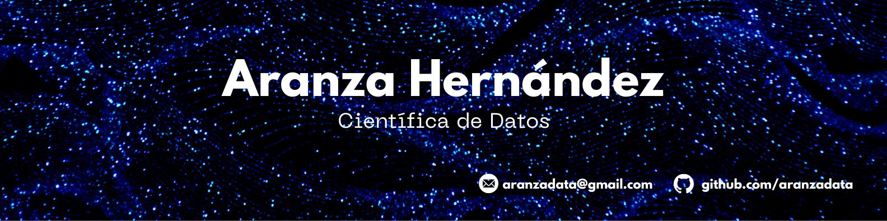

  

 

  # 💫 Acerca de mí:
¡Hola! Soy Aranza, física apasionada por la ciencia, matemáticas y programación. Mi formación científica, combinada con mi experiencia en la docencia, me ha brindado una sólida base técnica y una habilidad única para explicar conceptos complejos de manera clara y accesible.  En mi perfil de GitHub, encontrarás una variedad de proyectos que reflejan mi enfoque metódico y mi pasión por el aprendizaje continuo.   Estoy siempre en busca de oportunidades para colaborar en proyectos desafiantes y aportar mi experiencia a equipos multidisciplinarios. Si estás interesado en discutir ideas, proyectos o posibles colaboraciones, no dudes en contactarme.  ¡Gracias por visitar mi perfil!

# 💻 Tecnologías:
             

# 📊 Estadísticas:
<!--   -->
 

<!-- Proudly created with GPRM ( https://gprm.itsvg.in ) -->
